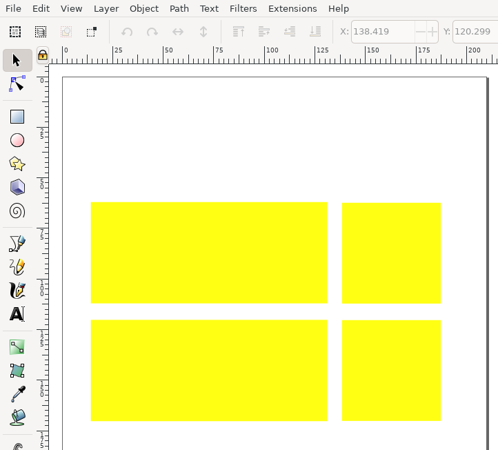
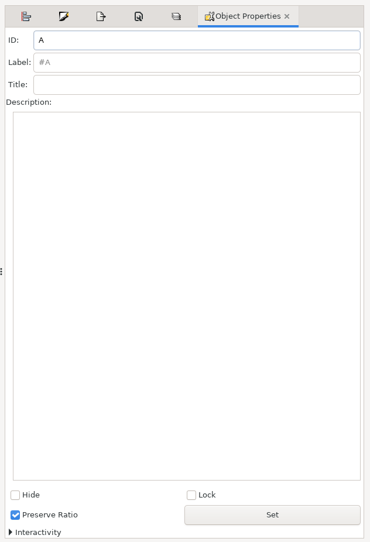
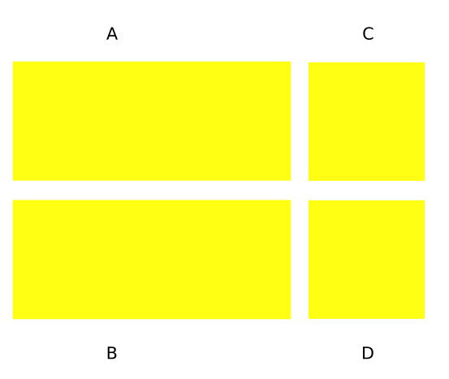
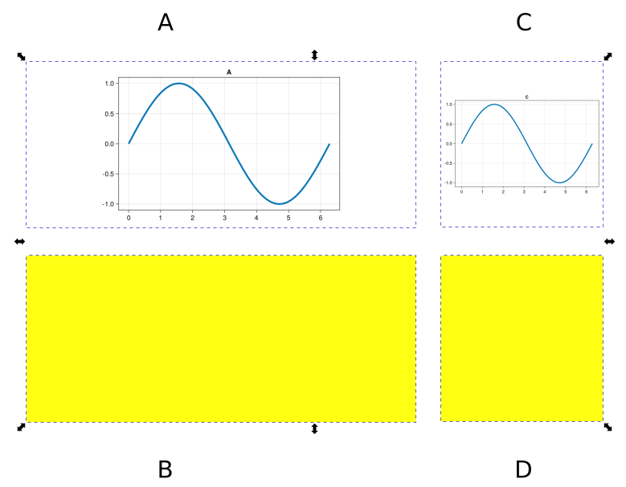
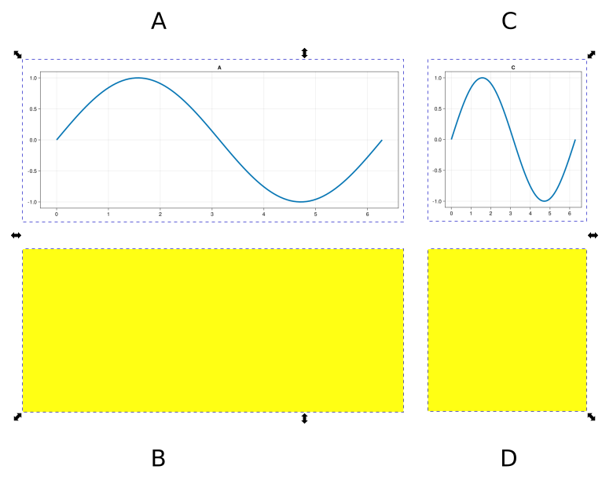
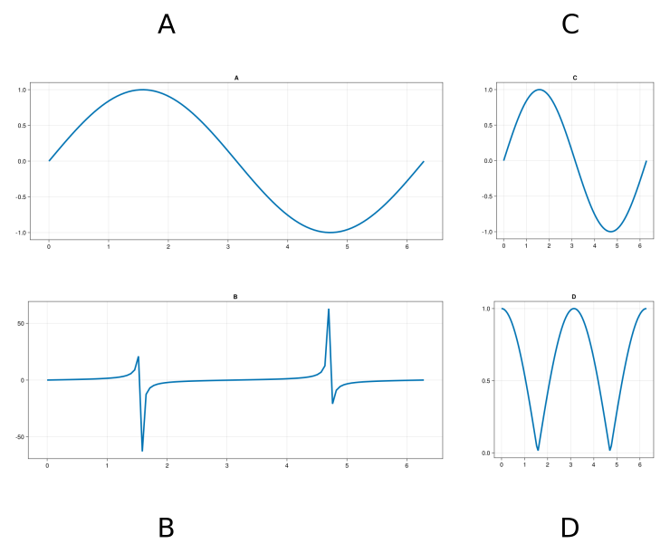
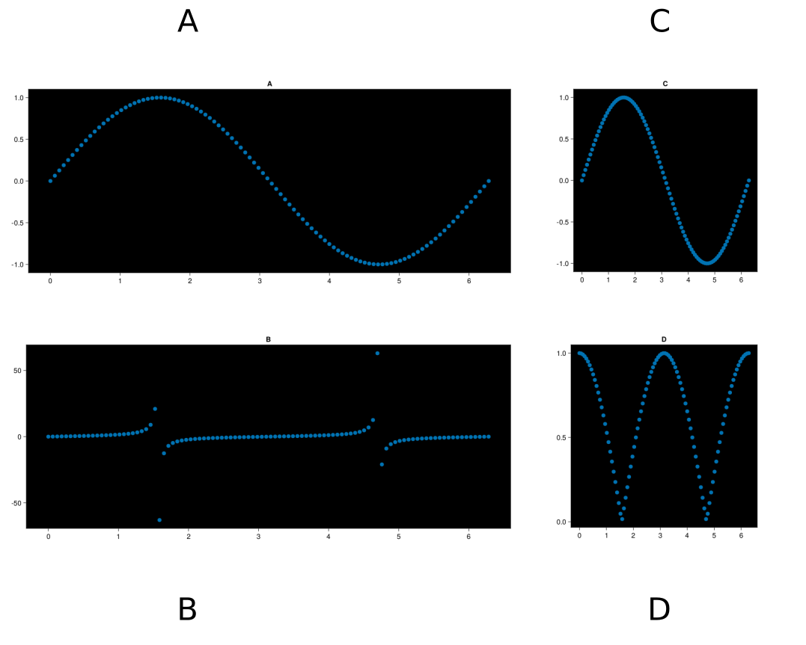

# Example

## Defining Layout In Inkscape
First, open inkscape and draw some rectangles with the `rectangle` tool (R):



Right click on each rectangle and click `Object Properties`



Then, change the label to something memorable and click `Set` - this 
will be how you reference each shape from julia. The rectangles
in this example are labeled `A` `B` `C` and `D` as such:



Now open julia and import `figure_second` and either a `Makie` library or `Plots.jl`:

## Loading the Inkscape document in Julia

```julia
using figure_second
using CairoMakie
```

then, create an `Updater` object that holds information on where the inkscape file is on disk. If 
you are ok with mutating the inkscape file in place, you can do

```julia
inkscape = updater("./path/to/file.svg")
```

then, we can find all the ids of the rectangles we just created with [`ids`](@ref):

```julia
ids(inkscape)
# outputs: ["A" "B" "C" "D"]
```

## Plotting into Inkscape

now, lets create general plotting function that we can reuse:

```julia
function my_plot(x, y, inkscape::Updater, inkscape_id::String)
	# manually set a resolution
	res = (600, 400)
	
	fig = Figure(resolution = res, dpi = 200)

	ax = Axis(fig[1,1], title = inkscape_id)
	
	lines!(ax, x, y, linewidth=4)

	return fig
end
```

and then place some data in the `A` rectangle for our figure:


```julia
x = range(0, 2pi, 100)
A = my_plot(x, sin.(x), inkscape, "A")

# a dictionary of keys (name of inkscape ID) and values 
# (figure objects)
mapping = Dict(
	"A" => A
)

# write all these figures into the inkscape svg
plot_figures(inkscape, mapping)
```

opening inkscape and going `File > Revert`, we will force reload inkscape 
to any changes that have happened in the file. Now the file looks like this:


Lets apply the same process to id `C`:

```julia
x = range(0, 2pi, 100)
A = my_plot(x, sin.(x), inkscape, "A")
# new figure!
C = my_plot(x, sin.(x), inkscape, "B")

# mapping of inkscape ids to figure objects
mapping = Dict(
	"A" => A,
	"C" => C,
)

# write all these figures into the inkscape svg
plot_figures(inkscape, mapping)
```



## Sizing plots to inkscape layout

it seems that `figure_second` is not respecting the aspect ratios of the inkscape objects which
in turn causes the plots to fill the allocated space poorly. To fix this we can use the [`relative_dimensions`](@ref)
function to calculate a figure resolution that respects the inkscape aspect ratio. Updating our `my_plot` 
function:

```julia
function my_plot(x, y, inkscape::Updater, inkscape_id::String)
	
	# every figure will have a height of 500, but the width will
	# change to respect the aspect ratio of the output
	desired_height = 500.
	local res = relative_dimensions(inkscape, inkscape_id, desired_height)

	fig = Figure(resolution = res, dpi = 200)

	ax = Axis(fig[1,1], title = inkscape_id)
	
	lines!(ax, x, y, linewidth=4)

	return fig
end
```

re-running the code and reloading the inkscape figure we have the following:



then we can adjust our plotting commands for the other boxes:

```julia
x = range(0, 2pi, 100)
A = my_plot(x, sin.(x), inkscape, "A")
C = my_plot(x, sin.(x), inkscape, "C")
B = my_plot(x, tan.(x), inkscape, "B")
D = my_plot(x, abs.(cos.(x)), inkscape, "D")

mapping = Dict(
	"A"=> A,
	"C"=> C,
	"B"=> B,
	"D" => D
)
```



## The beauty of `figure_second`

Lets say we want to change all the line plots to scatter plots, and make all background colors different:

```julia
function my_plot(x, y, inkscape::Updater, inkscape_id::String)
	# manually set a resolution
	local res = (600, 400)
	desired_height = 500.
	local res = relative_dimensions(inkscape, inkscape_id, desired_height)
	
	fig = Figure(resolution = res, dpi = 200)

	# now a black background
	ax = Axis(fig[1,1], title = inkscape_id, backgroundcolor=:black)
	
	# now a scatter plot
	scatter!(ax, x, y, linewidth=4)

	return fig
end
```

our figure now looks like:



Or, what if we moved all the rectangles in our figure:


rerendering in julia:


