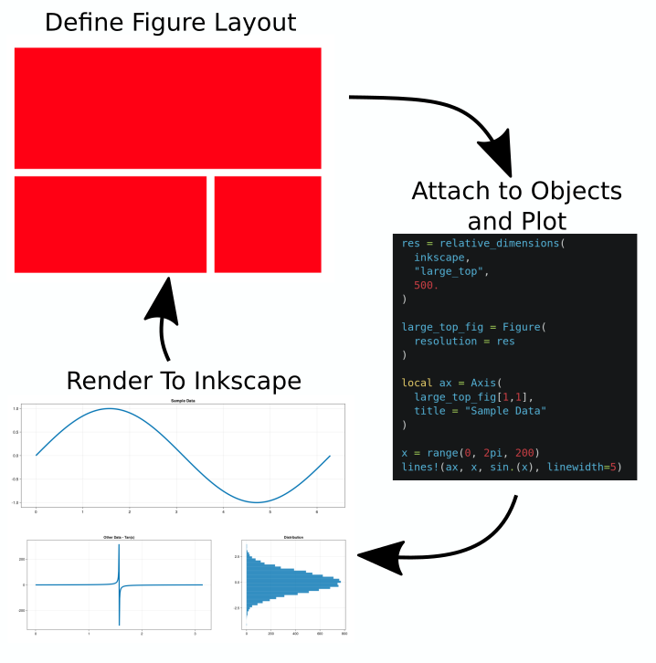

# Welcome

`figure_second` is a layout first approach to plotting based on the ideas of the python
library [figurefirst](https://flyranch.github.io/figurefirst/). The general workflow of the library
is to define a layout of graphs in inkscape, label each object with an XML `id`, and then plot 
*into* these objects using common julia plotting libraries (`Makie.jl`, `Plots.jl`, etc).

```@contents
Depth = 3
```

The overall process of using `figure_second` is as follows:


